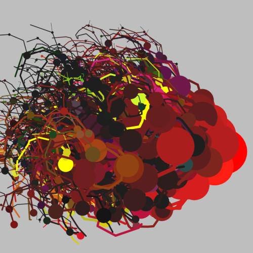
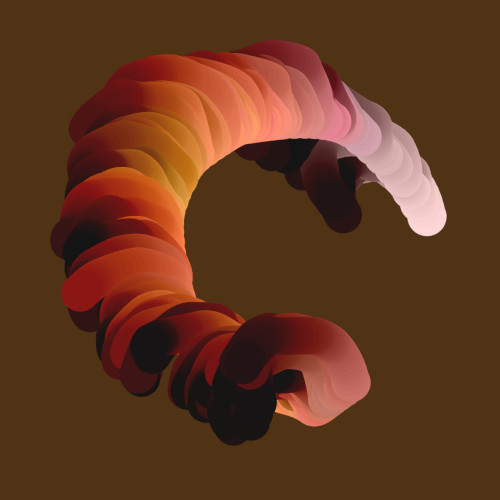
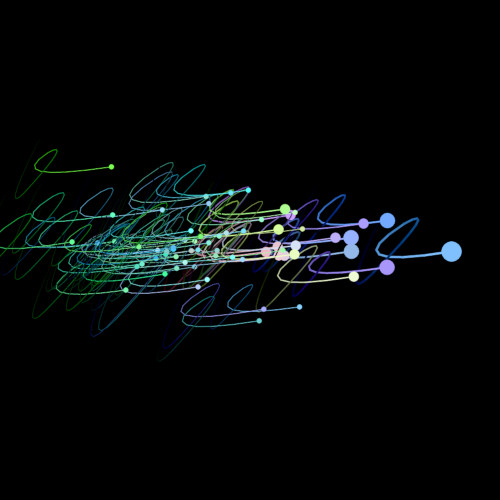

# Scribbles

* Python scripts using the Turtle library to generate images based on "scribbles".

* Inspired by Carl Lostritto's _Computational Drawing_
(Applied Research and Design, 2019).

## Table of Contents

- [Definitions](#definitions)
    <!-- - [LinearScribble](#linearscribble)
    - [BunchedScribble](#bunchedscribble)
    - [CurvyScribble](#curvyscribble) -->
- [Scribble Parameters](#scribble-parameters)
- [Transformations](#transformations)
- [Drawing Scribbles](#drawing-scribbles)
- [The Scripts: Sample Images](#the-scripts-sample-images)
    <!-- - [brain.py](#brainpy)
    - [grass.py](#grasspy)
    - [insects.py](#insectspy)
    - [rain.py](#rainpy)
    - [shards.py](#shardspy)
    - [skyline.py](#skylinepy)
    - [spiral.py](#spiralpy)
    - [swarm.py](#swarmpy)
    - [tunnel.py](#tunnelpy)
    - [worm.py](#wormpy) -->
- [Script Options](#script-options)
- [Requirements](#requirements)
- [Known Issues](#known-issues)
- [License](#license)


## Definitions

A scribble is a collection of points `(x, y)` lying along
the circumference of a circle,

```
x = r × cos(Θ)
y = r × sin(Θ)
```

except that the radius, `r`, and angle, `Θ`, vary randomly from point to point.

Joining the points with line segments produces the scribble design.

Three classes are provided to generate scribbles:

### LinearScribble


The points in a LinearScribble are far enough apart that the lines joining them
are visibly straight.

### BunchedScribble


BunchedScribbles contain points from separate quadratic Bezier curves so that the
lines joining them appear to form bunches of curves.

### CurvyScribble


CurvyScribbles also contain points from separate quadratic Bezier curves, but the
terminal end of each curve is actually the control point of the next curve, so
the lines joining them appear to form a continuous curve.

## Scribble Parameters

Each scribble can be constructed with a specific origin and methods to control
the angle and radius for generating each point.

To generate the points for a scribble, you supply an initial radius and a
maximum length.

```python
from random import randint
from scribble.core import LinearScribble

# Using defaults.
scribbler_1 = LinearScribble()

# Specify the origin, constrain the angle between ~4-5 radians, and gradually
# increase the radius for each point:
scribbler_2 = LinearScribble(origin=(0, 40)
                             angle_fn=lambda a: a + randint(229, 286),
                             radius_fn=lambda r: r + 0.5)

# Constrain the angle by modding by 180°:
scribbler_3 = LinearScribble(origin=(35, 40)
                             angle_fn=lambda a: (a + randint(1, 5)) % 180)

radius = 10
max_length = 1000
points_1 = scribbler_1.get_points(radius, max_length)
# …
```

## Transformations

Scribble points can be transformed using these operations:

* rotate
* translate
* scale
* mirror horizontally/vertically
* limit to bounding box


```python
from scribble.core import CurvyScribble, LinearScribble
from scribble.points import PointTransformer

# Create a transform to move scribbles 100 units to the left, scale them
# vertically by a factor of 5, and rotate them 15° counter-clockwise.
transformer = PointTransformer().translate(-100, 0).scale(1, 5).rotate(-15)

scribbler_1 = CurvyScribble()
scribbler_2 = LinearScribble()

points_1 = transformer.transform(scribbler_1.get_points(5, 500))
points_2 = transformer.transform(scribbler_2.get_points(10, 1000))
```

## Drawing Scribbles

The scripts use a context manager, `TurtleFactory`, to create and configure a
turtle with suitable options for drawing scribbles (e.g., turtle animation is
turned off, the image remains on-screen until closed by the user, etc.).

The manager can also be used to export the rendered image to an
EPS file.

```python
from scribble.core import CurvyScribble
from scribble.render import TurtleFactory

# Retrieve some runtime inputs from the command line …
# width, height, background_color, canvas_name, base_color, scaling_factor

with TurtleFactory(width, height, bg_color=background_color, canvas_name=canvas_name) as tf:

    turtle = tf.get_turtle()
    turtle.pensize(1)
    turtle.pencolor(base_color)

    def scale_point(p):
        return (x * scaling_factor for x in p)

    def draw(points):
        turtle.penup()
        turtle.setposition(scale_point(points[0]))
        turtle.pendown()
        for point in points[1:]:
            turtle.setposition(scale_point(point))

    scribbler = CurvyScribble()
    points = scribbler.get_points(10, 1000)
    draw(points)

    # Save image to disk.
    tf.export('/tmp/scribble.eps')
```

## The Scripts: Sample Images

### brain.py

|||
| --- | --- |


### grass.py

|||
| --- | --- |

### insects.py

|||
| --- | --- |


### rain.py

|||
| --- | --- |

### shards.py

|||
| --- | --- |

### skyline.py

|||
| --- | --- |

### spiral.py

|||
| --- | --- |

### swarm.py

|||
| --- | --- |

### tunnel.py

|||
| --- | --- |

### worm.py

|||
| --- | --- |

## Script Options

The scripts provide the following options, among others:

<table>
    <tbody>
        <tr>
            <td><code>-w &lt;width&gt;</code></td>
            <td>The width of the image, in pixels.</td>
        </tr>
        <tr>
            <td><code>-H &lt;height&gt;</code></td>
            <td>The height of the image, in pixels.</td>
        </tr>
        <tr>
            <td><code>-s &lt;scale&gt;</code></td>
            <td>The scaling factor for the image. Increase this to zoom into the image.</td>
        </tr>
        <tr>
            <td><code>-c &lt;r&gt; &lt;g&gt; &lt;b&gt;</code></td>
            <td>The initial RGB color for the design.</td>
        </tr>
        <tr>
            <td><code>-g &lt;r&gt; &lt;g&gt; &lt;b&gt;</code></td>
            <td>The background RGB color for the design.</td>
        </tr>
        <tr>
            <td><code>-q</code></td>
            <td>Quiet mode. Do not export the image to disk.</td>
        </tr>
        <tr>
            <td><code>-f &lt;folder&gt;</code></td>
            <td>The path of the folder to export the image to.</td>
        </tr>
    <tbody>
</table>

To see script-specific options, run the script with the `-h` option.

## Requirements
* Python 3
* The built-in Turtle library requires the Tk interface package, `tkinter`. There
is no Pip package for `tkinter` so you must install it on your system manually.

## Known Issues
The exported EPS file sometimes has a bounding box that is one-pixel too wide on
one or two sides. More investigation required.

## License

[MIT](LICENSE) © William Lockwood